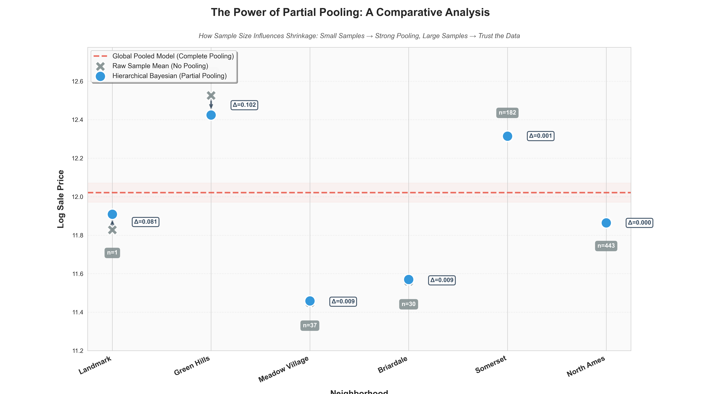

# Hierarchical Bayesian Modeling for Real Estate Valuation

This repository implements a **Hierarchical Bayesian Gaussian Model** to address the "Small Area Estimation" problem in real estate valuation. Using the Ames Housing dataset, this project demonstrates how **Partial Pooling** provides robust baseline valuations for neighborhoods with sparse transaction data, outperforming both naive sample means and global frequentist regression techniques.

## Project Overview

In automated valuation, estimating the intrinsic value of a specific neighborhood ("Location Effect") is challenging due to data sparsity. 
1.  **No Pooling (Naive Mean):** Calculating the raw average price is highly volatile for neighborhoods with few sales ($n < 5$).
2.  **Complete Pooling (Global Regression):** Treating the city as a monolith stabilizes variance but introduces bias by ignoring local luxury premiums.

This project implements a **Hierarchical Model** where neighborhood parameters are treated as latent variables drawn from a global distribution. This allows for **shrinkage**: the model trusts local data when sample sizes are large but "shrinks" estimates toward the city-wide mean when data is scarce.

## Key Features

*   **Custom Gibbs Sampler:** A full implementation of a Markov Chain Monte Carlo (MCMC) sampler written from scratch using NumPy/SciPy (no high-level probabilistic programming languages used).
*   **Partial Pooling:** implementation of a hierarchical structure that navigates the bias-variance tradeoff automatically.
*   **Uncertainty Quantification:** Generation of 95% Credible Intervals (CI) to quantify valuation risk, specifically identifying high-uncertainty markets.
*   **Comparison Framework:** A direct analytical comparison between Foundational Regression (OLS, Lasso, Ridge) and Bayesian Estimation.

## Methodology

### 1. Data Preprocessing
The target variable (`Sale_Price`) is log-transformed to satisfy the Gaussian likelihood assumption ($y = \log(1 + \text{Price})$). The primary analysis focuses on robustly estimating neighborhood intercepts $\theta_j$ while accounting for global variance.

### 2. Generative Process
We define a Varying-Intercept Gaussian Model:

$$ y_{ij} \sim \mathcal{N}(\theta_j, \sigma^2) \quad \text{(Likelihood)} $$
$$ \theta_j \sim \mathcal{N}(\mu, \tau^2) \quad \text{(Neighborhood Priors)} $$

Where $\mu$ is the global mean and $\tau^2$ is the between-neighborhood variance. This structure allows the model to "borrow statistical strength" across groups.

### 3. Inference
Inference is performed via a custom **Gibbs Sampler** exploiting conjugate priors (Normal-Normal and Gamma-Normal). The sampler runs for 10,000 iterations with a 2,000-sample burn-in period.

## Key Insights

### The Shrinkage Effect
The primary result of this study is the visualization of statistical shrinkage. The plot below compares the Naive Raw Mean (Gray X) against the Hierarchical Bayesian Estimate (Blue Dot).

*   **Data-Rich (North Ames, $n=443$):** The model ignores the prior and aligns perfectly with the raw data.
*   **Data-Poor (Landmark, $n=1$):** The raw mean is an outlier ($y \approx 11.82$). The model identifies this as unreliable and pulls the estimate significantly toward the global mean ($y \approx 11.90$), providing a conservative safeguard against overfitting.

### Risk Transparency
Unlike point-estimate models (Lasso/Ridge), the Bayesian framework exposes the lack of information in sparse areas.

As shown above, the 95% Credible Interval for **Landmark** is nearly 17x wider than for **North Ames**. This explicitly flags valuations in data-poor areas as "High Risk."